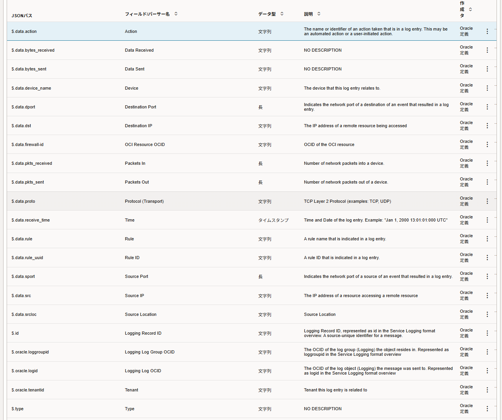

# Network Firewall Logs - Log Analytics Dashboard

## Logs
- Details for Network Firewall Logs  
    https://docs.oracle.com/en-us/iaas/Content/Logging/Reference/details_for_networkfirewall.htm

### Threat Log
- Action
    - allow: Flood detection alertを検知
    - deny: Flood detection alertを検知し、設定に基づきトラフィックを拒否
    - drop: 脅威を検出し、関連するセッションをドロップ
    - alert: 脅威またはURLを検知
    - reset-client: 脅威を検知し、ClientにTCP RSTを送信
    - reset-server: 脅威を検知し、ServerにTCP RSTを送信
    - reset-both: 脅威を検知し、双方にTCP RSTを送信
    - block-url: URLフィルタリングにより、セッションをブロック
    - block-ip: 脅威を検知し、クライアントIPをブロック
    - random-drop: Floodを検知し、セッションをランダムにドロップ

### Traffic Log
- Action
    - allow: ポリシーで許可されたセッション
    - deny: ポリシーで拒否されたセッション
    - drop: 静かにドロップされたセッション
    - drop-icmp: 「ICMP unreachable」を返した後、静かにドロップされたセッション
    - reset-both: 両サイドにTCP Resetを送信し、セッションを切断

### Tunnel Inspect Log
- Action
    - ALLOW
    - DENY
    - DROP
    - DROP ICMP
    - RESET BOTH
    - RESET CLIENT
    - RESET SERVER

## Parser
### OCI Network Firewall Traffic Log Format
(Oracle定義)

### OCI Network Firewall Threat Log Format
(Oracle定義)

### OCI Network Firewall Tunnel Log Format
(Oracle定義)

## 参考リンク
- [OCI Network Firewallのログ分析 ~ OCI Log Analyticsを利用したログ分析（基礎編）~ - Speaker Deck](https://speakerdeck.com/oracle4engineer/oci-network-firewallnorogufen-xi-o-and-m-logging-analyticswoli-yong-sitarogufen-xi-ji-chu-bian)
- [Details for Network Firewall Logs](https://docs.oracle.com/en-us/iaas/Content/Logging/Reference/details_for_networkfirewall.htm)
- [LIVEcommunity - Traffic Log - What's the difference between the "Type" field and the "action" field - LIVEcommunity - 573712](https://live.paloaltonetworks.com/t5/next-generation-firewall/traffic-log-what-s-the-difference-between-the-quot-type-quot/td-p/573712)
- [How to set up Palo Alto security profiles | TechTarget](https://www.techtarget.com/searchsecurity/feature/How-to-set-up-Palo-Alto-security-profiles)