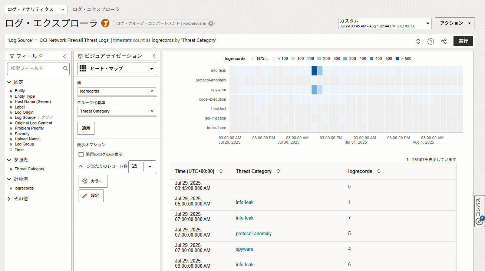

# Sample Queries
## Sample Dashboard
### 1. トラフィックの可視化

- **許可/拒否リクエスト数の推移**  
    時系列グラフで、許可と拒否のリクエスト数を比較。攻撃や誤設定を把握。
    ```
    'Log Source' = 'OCI Network Firewall Traffic Logs' | timestats count as logrecords by Action
    ```
    


- **地理的なアクセス分布マップ**
    ```
    'Log Source' = 'OCI Network Firewall Traffic Logs' | geostats count as logrecords | sort -logrecords
    ```
    


- **接続元IPアドレスのトップランキング**  
    バーチャートやテーブルで、最も多いアクセス元を可視化。特定の国やIPから集中していないか確認。
    ```
    'Log Source' = 'OCI Network Firewall Traffic Logs' | stats count as logrecords by 'Client Host Country' | sort -logrecords | top logrecords
    ```
    


- **通信プロトコル/ポート別のトラフィック量**  
    Pieや棒グラフで、TCP/UDPや特定ポートごとの割合を把握。
    ```
    'Log Source' = 'OCI Network Firewall Traffic Logs' | stats count as logrecords by 'Protocol (Transport)', 'Destination Port' | sort -logrecords | top 30 logrecords
    ```
    


### 2. セキュリティインシデント検知

- **拒否されたトラフィック**  
    検知された脅威カテゴリ
    ```
    'Log Source' = 'OCI Network Firewall Threat Logs' | timestats count as logrecords by 'Threat Category'
    ```
    
    


- **異常な通信パターン検知**  
    ログデータの中から、「通常はあまり出ないエラーや例外」などの異常な振る舞いを検知
    ```
    'Log Source' in ('OCI Network Firewall Traffic Logs', 'OCI Network Firewall Threat Logs') | clustercompare timeshift = -7day size = 7day
    ```
    


- **脅威インジケータとの突合結果**  
    OCI Threat Intelligenceと連携して、既知の悪性IPからのアクセス数をグラフ化。
    ```
    'Log Source' in ('OCI Network Firewall Traffic Logs', 'OCI Network Firewall Threat Logs') | timestats count('Threat IPs')
    ```
    

    ```
    'Log Source' in ('OCI Network Firewall Traffic Logs', 'OCI Network Firewall Threat Logs') | stats count('Threat IPs'), trend(count('Threat IPs'))
    ```
    


### 3. パフォーマンスと利用状況

- **ファイアウォールルールごとのヒット数**  
    どのポリシーで拒否されているかを可視化。
    ```
    'Log Source' = 'OCI Network Firewall Traffic Logs' | timestats count as logrecords by Rule
    ```
    


- **処理したセッション数の推移**  
    トラフィック負荷を時系列で確認。
    ```
    'Log Source' = 'OCI Network Firewall Traffic Logs' | timestats sum('Packets In') as total_in, sum('Packets Out') as total_out
    ```
    

    ```
    'Log Source' = 'OCI Network Firewall Traffic Logs' | timestats sum('Packets In') as total_in, sum('Packets Out') as total_out | eval total_packets = total_in + total_out | fields -total_in, -total_out
    ```
    


- **ログ生成量の傾向**  
    ファイアウォールの稼働状況を俯瞰。
    ```
    'Log Source' in ('OCI Network Firewall Traffic Logs', 'OCI Network Firewall Threat Logs') | timestats count as logrecords by 'Log Source'
    ```

    


## SFD
### Top 10 Denied Destination Ports

```
'Log Source' in ('OCI Network Firewall Traffic Logs', 'OCI Network Firewall Threat Logs') and Action like 'drop%' or Action = 'reset-both' | link 'Destination Port', 'Source IP' | fields -'Start Time', -'End Time'
```


### Top 10 Allowed Destination Ports
```
'Log Source' in ('OCI Network Firewall Traffic Logs', 'OCI Network Firewall Threat Logs') and Action in (allow, alert) | link 'Destination Port', 'Source IP' | fields -'Start Time', -'End Time'
```


### Top 10 Denied Sources
```
'Log Source' in ('OCI Network Firewall Traffic Logs', 'OCI Network Firewall Threat Logs') and Action in (deny, drop, 'reset-both', 'drop-icmp') | stats count as 'Denied Connections' by 'Source IP' | top 'Denied Connections'
```


### Top 10 Source IPs
```
'Log Source' in ('OCI Network Firewall Traffic Logs') | stats count by 'Source IP' | top Count
```


### Top 10 Destination IPs
```
'Log Source' in ('OCI Network Firewall Traffic Logs') | stats count by 'Destination IP' | top Count
```


### Policy hit count by name
```
'Log Source' in ('OCI Network Firewall Traffic Logs') | link Rule, Action, Entity | rename Entity as Firewall | stats avg('Packets In') as 'Packets In', latest(Time) as Latest_Hit
```


### Threat Logs By Threat Subtype Device
```
'Log Source' = 'OCI Network Firewall Threat Logs' | link Severity, Threat, 'Protocol (Transport)', Subtype | stats unique(Entity) as Firewall, unique('Threat Category') as 'Threat Category', unique(Action) as Action | eval score = if(Severity = critical, 10, Severity = high, 8, Severity = medium, 5, Severity = low, 2, Severity = informational, 1, 0) | sort -score, -Count | fields -'Start Time', -'End Time', -score | classify topcount = 300 correlate = -*, Action, 'Threat Category' Severity, Subtype, Threat as 'Threat Analysis'
```


