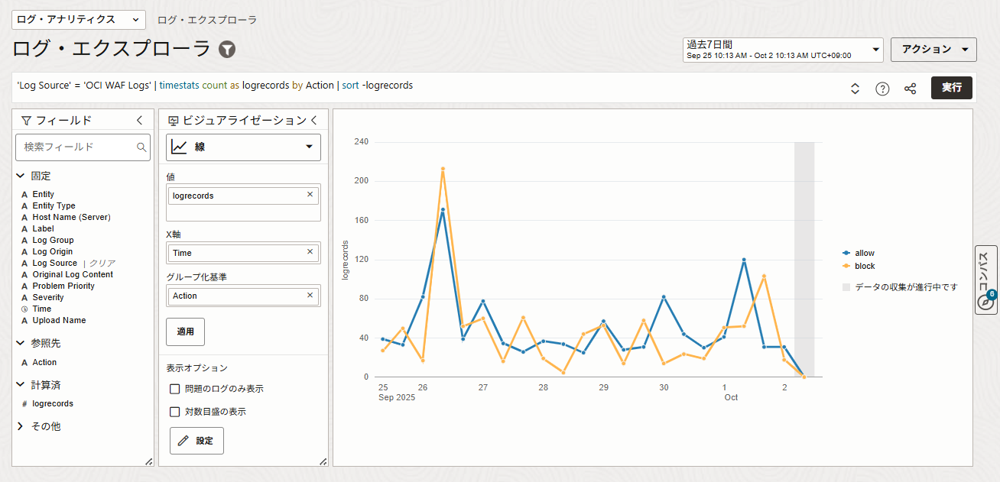
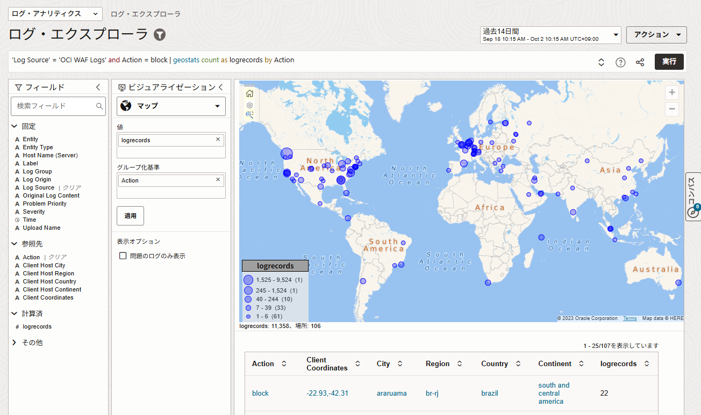
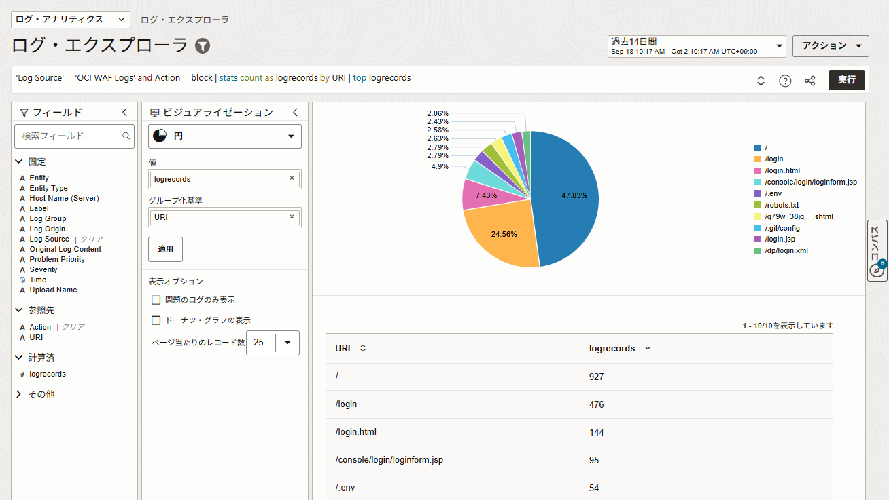
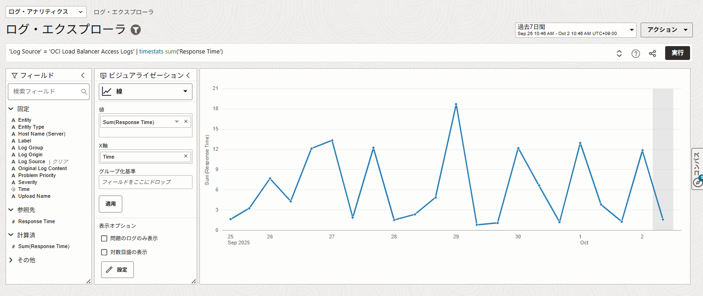
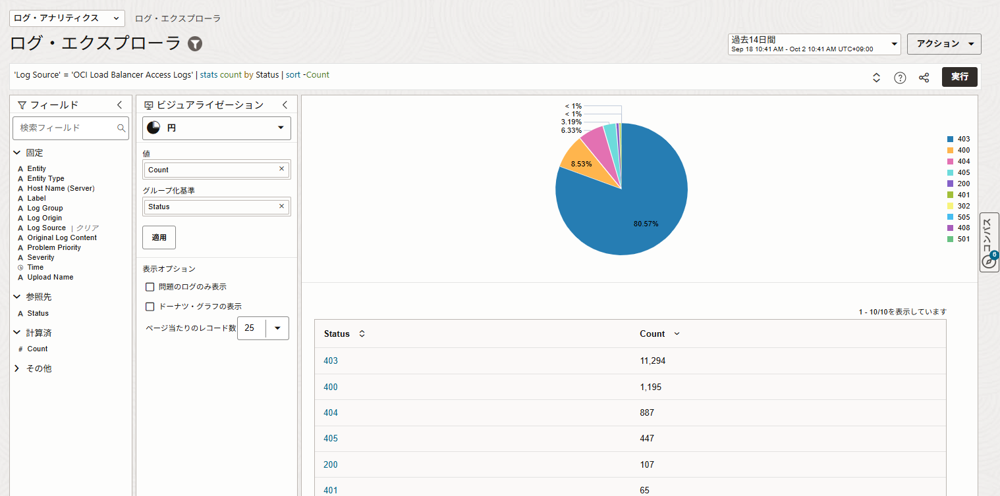
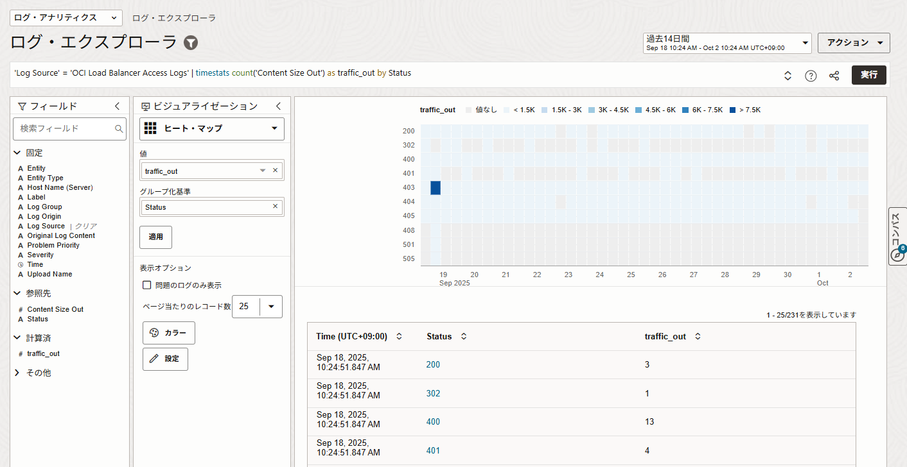
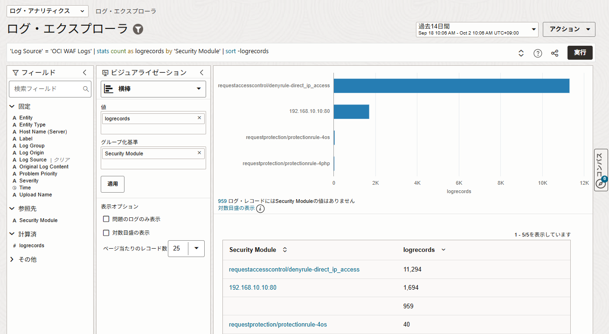
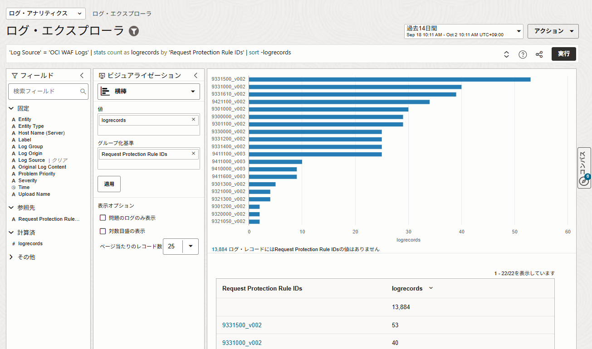

# Sample Queries
## Sample Dashboard
### 1. 攻撃検知・セキュリティ関連のグラフ    

- **アクション別トラフィック**  
    - allow / block / log / challenge などのWAFアクション件数の推移。
    - 実際にブロックされている攻撃数 vs 通過しているトラフィックを可視化。
    ```
    'Log Source' = 'OCI WAF Logs' | timestats count as logrecords by Action | sort -logrecords
    ```
    

- **攻撃元の国・IPランキング**
    - 上位の攻撃送信元IPや国を棒グラフや地図（Geo Map）で表示。
    - 特定地域やボットネットからの攻撃集中を把握。

    ```
    'Log Source' = 'OCI WAF Logs' and Action = block | geostats count as logrecords by Action
    ```
    

- **攻撃対象パス / URL ランキング**
    - どのエンドポイント（/login, /api/v1/...など）が攻撃を受けているかを棒グラフに。
    - セキュリティ強化が必要なエンドポイントを特定。
    ```
    'Log Source' = 'OCI WAF Logs' and Action = block | stats count as logrecords by URI | top logrecords
    ```
    

### 2. トラフィック・利用状況のグラフ

- **リクエスト数の時系列推移**
    - 時間帯ごとのリクエスト数。ピーク時間や攻撃集中時間を可視化。
    ```
    'Log Source' = 'OCI Load Balancer Access Logs' | timestats sum('Response Time')
    ```
    


- **レスポンスコード分布**
    - 2xx, 3xx, 4xx, 5xx の割合を円グラフや時系列グラフで表示。
    - アプリケーションやWAF設定の影響でエラーが増えていないかを確認。
    ```
    'Log Source' = 'OCI Load Balancer Access Logs' | stats count by Status | sort -Count
    ```
    

    ```
    'Log Source' = 'OCI Load Balancer Access Logs' | timestats count('Content Size Out') as traffic_out by Status
    ```
    

- **リクエストサイズ・レスポンスタイム分布**
    - 平均・最大値などをヒストグラム化。異常なサイズのリクエストを攻撃の兆候として検出。


### 3. 運用・チューニング用のグラフ

- **ルール別ヒット数**
    - 保護ルールやシグネチャごとのマッチ件数。
    - 不要な誤検知や過剰なブロックを特定してルール調整に活用。
    ```
    'Log Source' = 'OCI WAF Logs' | stats count as logrecords by 'Security Module' | sort -logrecords
    ```
    

    ```
    'Log Source' = 'OCI WAF Logs' | stats count as logrecords by 'Request Protection Rule IDs' | sort -logrecords
    ```
    

### 4. レポート用ダッシュボード構成例

- **「攻撃検知サマリー」：攻撃タイプ別件数、アクション別件数、攻撃元の地図**

- **「利用状況サマリー」：総リクエスト数、レスポンスコード分布、ピークトラフィック時間帯**
